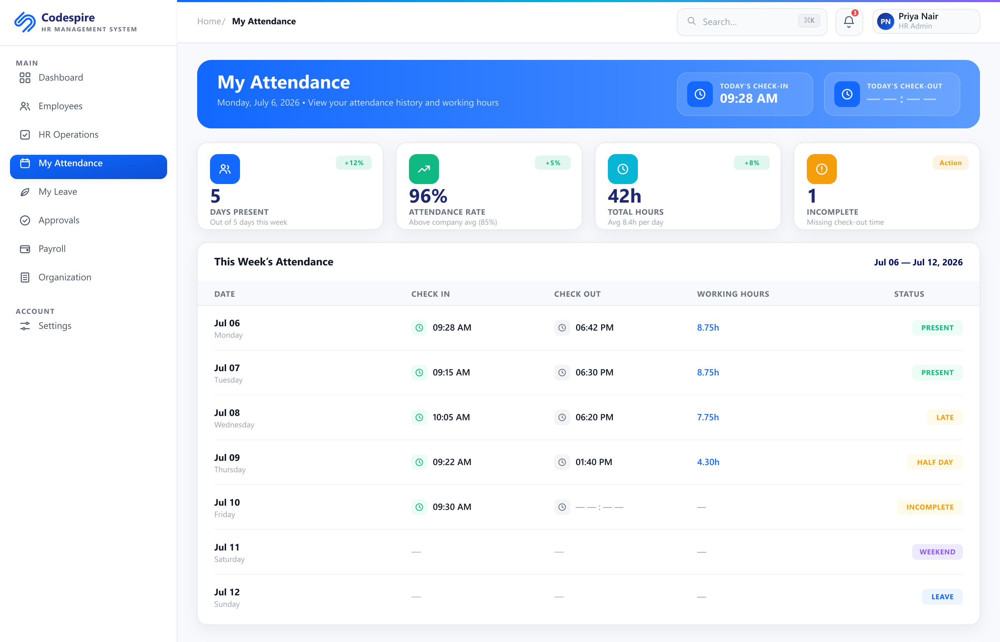

# Admin Guide — your first 30 minutes

This guide is for the **admin** — the person who sets up Codespire PMT-HRMS for the
office. Follow it once, in order, and your team will be ready to use the app. No
technical knowledge needed.

> **Before you start:** the app should be installed and running on the host PC. If
> not, do that first: [Windows](INSTALL-WINDOWS.md) · [Mac](INSTALL-MAC.md).

---

## 1. Create your admin account (first launch)

On the very first launch, the app shows a **Create your admin account** screen. You
choose the email and password yourself — there is no default password.

1. Enter an **Email** (for example `admin@yourcompany.com`).
2. Choose a strong **Password** (at least 8 characters) and confirm it.
3. Click **Create admin account**.

The app opens the **launcher**, where you choose **Open PMT** or **Open HRMS**.

> Already created it? Skip to the next step.

---

## 2. Open HRMS and get your bearings

Most of the setup below lives in **HRMS**.

1. On the launcher, click **Open HRMS**. (You can switch to PMT any time from the
   **Apps** menu, or the tray / menu-bar icon.)
2. You'll land on the HRMS dashboard.

---

## 3. Set your company details and email (Credential Settings)

Open **Credential Settings** from the HRMS sidebar. This is where you set your
company name and connect email.

1. **Company tab** — enter your **company name**. This appears on emails, offer
   letters, and PDFs the app generates.
2. **Email tab (SMTP)** — if you want the app to send emails (onboarding invites,
   notifications), enter your mail provider's SMTP details:
   - SMTP host, port, username, password, and the "from" email address.
   - Click **Send test** to send yourself a test email and confirm it works.
   - No SMTP? You can skip this — the app still works; it just won't send emails.

---

## 4. Add your people and give them roles

Add HR staff, managers, and employees from the **Employees** page in HRMS. Each
person's **role** controls what they can see and do.

1. Open **Employees** from the HRMS sidebar.
2. Click **Add** (or **Add Employee**) and fill in their details.
3. Choose a **role** (for example HR, Manager, Employee). The role decides their
   access.
4. Save. Repeat for each person.

> **Tip — onboarding a manager so they're active immediately:** set their
> **joining date to today**, and **leave the "Reporting Manager" field blank**. A
> manager with no reporting manager and a joining date of today is treated as
> active right away, so they can log in and start managing their team without
> waiting.

Once people are added, share the login links with them (Step 8). Their day-to-day
tasks are covered in the [User Guide](USER-GUIDE.md).

---

## 5. Set up biometric attendance (optional)

If your office uses a **biometric device** (fingerprint / face machine), you can
have each punch become a check-in / check-out automatically. There are two parts.

### 5a. Give the device the push URL and token

Open **Credential Settings → Attendance Device** tab in HRMS. This page shows the
**push URL** and an optional **token** you hand to your device vendor.

1. Copy the **push URL** shown on the page. It looks like:
   `http://<host-ip>:4000/api/v1/biometric/realtime-push`
   (for example `http://192.168.1.50:4000/api/v1/biometric/realtime-push`).
2. If a **token** is shown, copy it too. The device must send it as the
   `x-device-token` header.
3. In your biometric device's cloud portal (its "third-party push" / "parallel
   data export" settings), paste that URL so the machine sends each punch to the
   app.

### 5b. Map each employee to their device ID

Open **Biometric Mappings** from the HRMS sidebar.

1. For each employee who uses the device, enter their **device enrolment number**
   (the ID they punch in with on the machine).
2. Save. Now, when they punch, the app knows which employee it is and records their
   attendance.

> Full technical detail (payloads, test punches, offline import, troubleshooting)
> is in [biometric-attendance.md](biometric-attendance.md).

---

## 6. Reset the admin password (if you ever forget it)

You reset the admin password **from the app on the host PC** — no email or code
needed. This is **host-only** (it can only be done on the PC where the app runs),
and **all your data is preserved** — only the password changes.

1. On the host PC, find the Codespire icon in the **tray** (Windows, near the
   clock) or **menu bar** (Mac, top-right). You can also use the **Help** menu at
   the top of the app window.
2. Click **Reset admin password…**.
3. Enter a new password (or click **Generate strong password**) and confirm it.
4. Click **Reset password**. The app confirms the change; the new password works
   immediately.

> Because this only works on the host PC, no one outside the office can reset your
> admin password. Keep the host PC secure.

---

## 7. Share the links + allow team access (firewall)

Your team uses the app from their browsers. Give them the links, and make sure the
firewall lets them connect.

1. On the launcher screen (or the tray / menu-bar menu → **Open share links**),
   find the **"Share on your network"** links, for example:
   - **PMT:** `http://192.168.1.50:3001`
   - **HRMS:** `http://192.168.1.50:3000`
2. **Allow team access through the firewall:**
   - **Windows:** the first time the app runs, Windows may pop up a firewall
     prompt — click **Allow access** (choose Private networks). This lets
     teammates on the network reach the app.
   - **Mac:** if macOS's firewall is on and prompts you, choose **Allow incoming
     connections**.
3. Send the two links to your team. They open them in **Chrome / Edge / Safari** and
   log in with the accounts you created in Step 4.

> **Links stop working after a reboot?** The host PC's network address (IP) can
> change when the router restarts. The app always shows the current link on the
> launcher and tray menu — re-share it. For a permanent fix, ask whoever manages
> your router to give the host PC a **fixed IP** (DHCP reservation).

---

## 8. Back up your data (copy the data folder)

All your data — projects, employees, attendance, settings, uploaded files — lives
in **one folder on the host PC**. Backing up is simply **copying that folder**.

**Where it is:**

| System | Data folder |
|--------|-------------|
| Windows | `C:\Users\<you>\AppData\Roaming\codespire-pmt-hrms\data` |
| Mac | `~/Library/Application Support/codespire-pmt-hrms/data` |

**How to back up safely:**

1. **Quit the app fully first** (tray / menu-bar icon → **Quit**). This makes sure
   nothing is being written while you copy.
2. Copy the whole **`data`** folder to a USB drive, another PC, or cloud storage.
3. Start the app again.

> On Windows, `AppData` is hidden. Paste the path into the File Explorer address
> bar, or turn on **View → Show → Hidden items**. Your data always stays on this
> PC — nothing goes to the cloud unless you copy it there.

---

## Quick checklist

- [ ] Created the admin account
- [ ] Set company name (Credential Settings → Company)
- [ ] Configured email and sent a test (Credential Settings → Email) — optional
- [ ] Added HR, managers, and employees with roles
- [ ] (Optional) Set up the attendance device + biometric mappings
- [ ] Shared the PMT/HRMS links and allowed the firewall
- [ ] Made a first backup of the `data` folder

Need help with anything else? See the [FAQ](FAQ.md).
