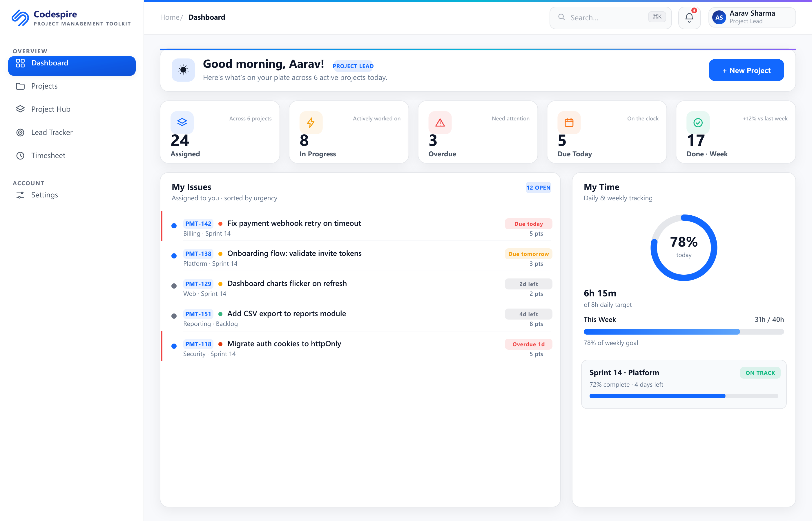
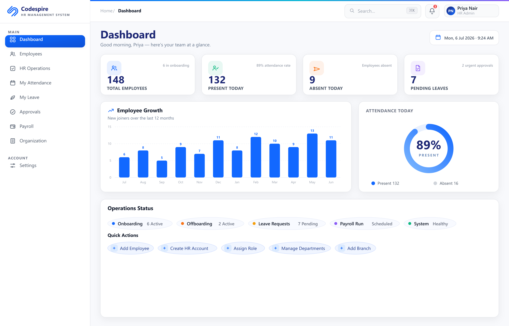

# Install Codespire PMT-HRMS on Mac

This guide walks you through installing the app on **one Mac** — the "host". You do
**not** need to be technical. It's drag-and-drop, then you create your admin
account.

> **What runs where?** The app runs on this one Mac. Your teammates just open a
> link in their browser — they install nothing. They must be on the **same office
> Wi-Fi/network**, and this Mac must be **switched on**.

---

## Before you start

- A Mac that will stay on during office hours.
- About 5 minutes.

You do **not** need Docker or any other software. Everything is inside the download.

---

## Step 1 — Download the app

1. Open the **Download** section of the project page and download the Mac version.
   It is a single file that ends in **`.dmg`** (for example
   `Codespire-PMT-HRMS.dmg`).
2. It usually lands in your **Downloads** folder.

---

## Step 2 — Drag the app to Applications

1. **Double-click the `.dmg`** file. A window opens showing the **Codespire
   PMT-HRMS** icon and a shortcut to your **Applications** folder.
2. **Drag the Codespire icon onto the Applications folder** in that same window.
3. When it finishes copying, close the window and **eject** the `.dmg` (right-click
   it on the desktop → **Eject**).

---

## Step 3 — Open it the first time (Gatekeeper)

The first time you open a newly downloaded app, macOS asks you to confirm.

1. Open your **Applications** folder and find **Codespire PMT-HRMS**.
2. **Right-click (or Control-click) the app → Open.**
3. macOS shows a box asking if you're sure. Click **Open** again.
4. You only do this the first time. After that, open it normally from
   Applications, Launchpad, or Spotlight.

> If macOS says the app "cannot be opened", make sure you used **right-click →
> Open** (not a plain double-click) — that's what tells macOS you trust it.

---

## Step 4 — First launch

1. The very first launch takes a little longer while the app sets itself up in the
   background. That's normal — wait for the window to appear.
2. Because this is the first time, the app shows the **Create your admin account**
   screen. (On later launches it goes straight to the app.)

---

## Step 5 — Create your admin account

The **admin** is the main account that manages the whole system. You choose the
email and password now — there is no default password to look up.

1. Enter an **Email** (for example `admin@yourcompany.com`).
2. Choose a **Password** — at least **8 characters**. Pick something strong and
   write it down somewhere safe.
3. Re-enter it in **Confirm password**.
4. Click **Create admin account**.

The app confirms and opens the **launcher** — the screen where you choose **Open
PMT** or **Open HRMS**.

> This account is stored **only on this Mac**. Keep the password safe. If you ever
> forget it, you can reset it from the app itself — see
> [ADMIN-GUIDE.md](ADMIN-GUIDE.md) → "Reset the admin password".

---

## Step 6 — Open PMT and HRMS

1. On the launcher screen, click **Open PMT** (Project Management) or **Open HRMS**
   (HR Management). The app opens that tool in the same window.
2. You can switch any time from the **Apps** menu in the menu bar, or from the
   Codespire **menu-bar icon** (top-right).

---

## Step 7 — Let your team in

Your teammates open the app in their browser using a link the app gives you.

1. On the launcher screen, look under **"Share on your network"** — it shows your
   team links, for example:
   - **PMT:** `http://192.168.1.50:3001`
   - **HRMS:** `http://192.168.1.50:3000`
2. If macOS's firewall is on and prompts you, choose **Allow incoming connections**
   so teammates on the network can connect.
3. Send those two links to your team. They open them in **Chrome, Edge, or Safari**
   and log in with the accounts you create for them.

Full details on adding people, email, and attendance devices are in the
[Admin Guide](ADMIN-GUIDE.md).

---

## Daily use

| Action | How |
|--------|-----|
| **Start the app** | Open **Codespire PMT-HRMS** from Applications, Launchpad, or Spotlight |
| **Keep it running** | Just close the window — it keeps running in the **menu bar** (top-right) |
| **Fully stop it** | Click the menu-bar icon → **Quit** |

The host Mac must stay **on** for teammates to use the app.

---

## If something goes wrong

- **macOS blocks the app:** use **right-click → Open** the first time (Step 3).
- **A teammate can't connect:** check they're on the **same Wi-Fi**, that the host
  Mac is **on**, and that you allowed the firewall prompt. See the [FAQ](FAQ.md).
- **Forgot the admin password:** reset it from the menu-bar/Help menu — see the
  [Admin Guide](ADMIN-GUIDE.md).

More answers: [FAQ.md](FAQ.md).
