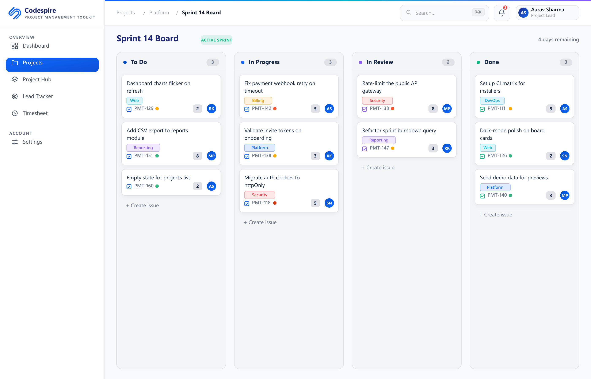

# User Guide — for the team

Welcome. This short guide shows you how to use **Codespire PMT-HRMS** for your
day-to-day work: tracking projects in **PMT** and managing attendance and leaves in
**HRMS**. You don't install anything — you just open a link in your browser.

---

## 1. Open the app

Your admin shares two links with you (they work on the office network):

- **PMT (Project Management):** `http://<host-ip>:3001`
- **HRMS (HR Management):** `http://<host-ip>:3000`

1. Open **Chrome, Edge, or Safari**.
2. Paste one of the links into the address bar and press **Enter**.
3. **Tip:** bookmark both links so you can find them quickly.

> **Can't reach the link?** Make sure you're on the **same office Wi-Fi** as the
> host PC, and that the host PC is switched on. If it still won't open, ask your
> admin — see the [FAQ](FAQ.md).

---

## 2. Log in

1. Enter the **email** and **password** your admin gave you.
2. Click **Sign in**.
3. If it's your first time, change your password from your **profile menu**
   (top-right) if the option is available.

---

## 3. PMT basics (Project Management)

PMT is where your team plans and tracks work.

- **Dashboard** — your starting point: an overview of your projects and what needs
  attention.
- **Boards** — work shown as cards in columns (for example *To Do → In Progress →
  Done*). Drag a card from one column to the next as work moves along.

  

- **Issues** — the list of tasks/tickets. Click one to open it, read the details,
  add comments, change its status, or assign it to someone.

  

- **Time** — log the time you spend on an issue so your team can see effort and
  progress.

**A typical flow:**
1. Open your **board** or the **issues** list.
2. Pick the issue assigned to you and open it.
3. Update its **status** as you work, add **comments** to keep others informed, and
   **log time** when you're done.

---

## 4. HRMS basics (HR Management)

HRMS is where you handle attendance and leaves.

### Attendance — check in and check out

1. Open **Attendance** from the HRMS menu.
2. Click **Check in** when you start your day.
3. Click **Check out** when you finish. The app records your hours automatically.

> **Using a biometric device?** If your office has a fingerprint / face machine,
> your punches may be recorded for you automatically — you might not need to click
> anything. Ask your admin how your office works.

### Leaves — request time off

1. Open **Leaves** (or **Leave Requests**) from the HRMS menu.
2. Click **Apply / Request leave**.
3. Choose the **type** (for example casual, sick), the **dates**, and add a short
   **reason**.
4. Submit. Your manager or HR reviews and approves it, and you'll see the status
   update.

---

## 5. Everyday tips

- **Bookmark** both links (PMT and HRMS) for quick access.
- The app works best in **Chrome or Edge**.
- If a link stops working, the host PC's address may have changed — ask your admin
  for the current link.
- Forgot **your** password? Ask your admin to help reset it. (The **admin's** own
  password is reset on the host PC — see the [Admin Guide](ADMIN-GUIDE.md).)

Questions? See the [FAQ](FAQ.md).
